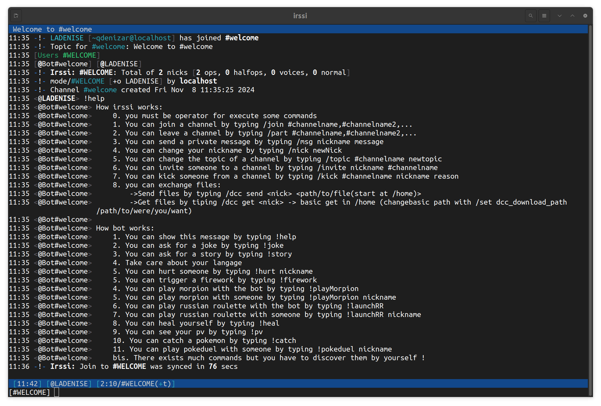
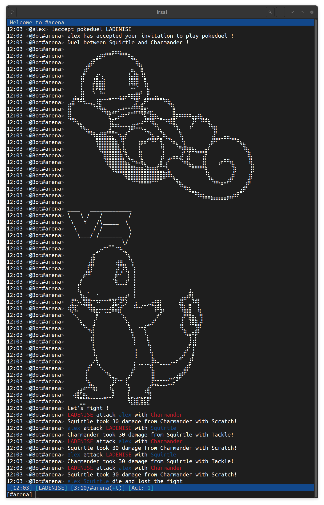
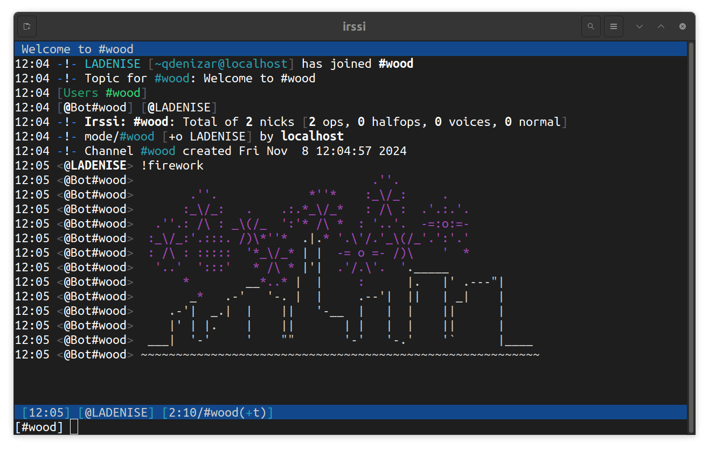
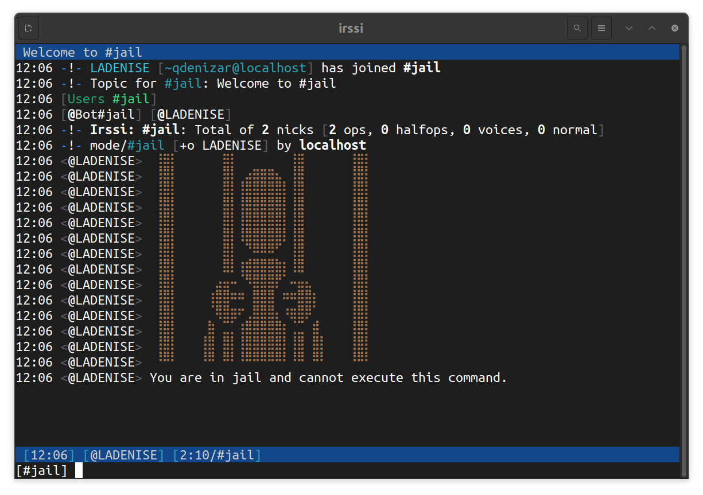

# FT_IRC

## USAGE
Assurer vous d'avoir le client IRSSI d'installe sur votre machine.
A la racine du projet, il suffit d'utiliser la commande :

```
make
```
Ensuite il suffit d'executer le programme avec **./ircserv [port] [password]**
- **port** : Le numéro du port sur lequel votre serveur acceptera les connexions entrantes.
- **password** : Le mot de passe permettant de s’identifier auprès de votre serveur
IRC, et qui devra être fourni par tout client IRC souhaitant s’y connecter
par exemple :

```
./ircserv 6667 mdp
```
Voila le serveur est lance ! 
Pour le rejoindre,  il faut se connecter au client IRSSI avec la commande:
```
irssi
```
Une fois connecte, il faut rejoindre le serveur avec /connect [ip] [port] [password]
En reprenant notre exemple cela donnerai :
```
/connect 10.13.1.7 6667 mdp
```

Vous pouvez egalement vous connecter avec **netcat** via un terminal :
```
nc [ip] [port]
PASS [password]
USER [username] * 0 :[username]
NICK [NICKNAME]
```
Une fois cette etape franchis, il ne vous reste plus qu'a profiter des fonctionnalites du serveur !

## Les commandes implemente par le serveur :
- KICK - Ejecter un client du channel
- INVITE - Inviter un client au channel
- TOPIC - Modifier ou afficher le thème du channel
- MODE - Changer le mode du channel :
  - i : Définir/supprimer le canal sur invitation uniquement
  - t : Définir/supprimer les restrictions de la commande TOPIC pour les opérateurs de canaux
  - k  : Définir/supprimer la clé du canal (mot de passe)
  - o : Donner/retirer le privilège de l’opérateur de canal
  - l : Définir/supprimer la limite d’utilisateurs pour le canal

## Les commandes par defaut IRSSI :
/join [nomDuChannelARejoindre] => Permet de rejoindre le channel specifie en parametre.
Une fois un channel rejoint, faite appel au bot pour avoir un apercu des possibilite avec la commande :
```
!help
```
<div>
  
<div>

### N'hesiter pas a participer a un duel Pokemon
<div>
  
<div>
  
### A admirer un magnifique feu d'artifice
Attention a ne pas se bruler les doigts !
<div>
  
<div>

## Surtout, attention a ne pas blesser les autres utilisateur par la violence ou par les insultes
<div>
  
<div>

## 🤝 Contribution

Ce projet a été réalisé avec les personnes suivantes :

- [Axel Kastler](https://github.com/ChromaXard)
- [Alexandre Herrmann](https://github.com/alexandre6795)  
- [Quentin Denizart](https://github.com/LaDeniseDe42)  


